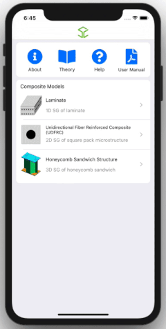

## SwiftComp iOS App
SwiftComp is a user-friendly app for computing properties for composites

The current functionalities of this app are:
1. Calculate effective beam stiffness matrix for beam model.
2. Calculate A, B, D matrices, transverse shear stiffness matrix, in-plane properties, and flexural properties for plate model.
3. Calculate effective solid stiffness matrix and engineering constants for solid model.
4. Calculate coefficient of thermal expansions (CTEs) for the thermoelastic analysis.
5. Use Gmsh as mesh generator to generate mesh and image.

The current composites models are:
1. Laminate
2. Unidirectional fiber reinforced composite
3. Honeycomb Sandwich Structure

We are constantly adding more functionalities into this App.

## Demo gif

## Download

## Privacy
https://cdmhub.org/legal/terms

## License
MIT © [Banghua Zhao](http://www.banghuazhao.com/)
